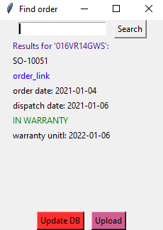

#Check-warranty
Fills a database with data obtained via Zoho APIs. Graphical interface for easy access to the data. Project consists of two parts.  
* Tkinter UI
    * **Search** by: device's serial number, order's postcode, order's number or customer's name, returns: matching orders, links to them, order and dispatch dates, warranty status.  
    * **Update DB** adds new orders data to database.  
    * **Upload** takes data from spreadsheet and uploads it to database.  
  
* Update DB has 2 modes, update and populate. Update is connected to the UI button. Populate gathers data of all the orders from CRM and Inventory and inserts them to the database. Files attached to Inventory orders (containing serial numbers) are opened and scrapped on the fly, when needed. Also looks for mentions of extended warranty. Those are put into spreadsheet for a manual approval before adding to the DB.
